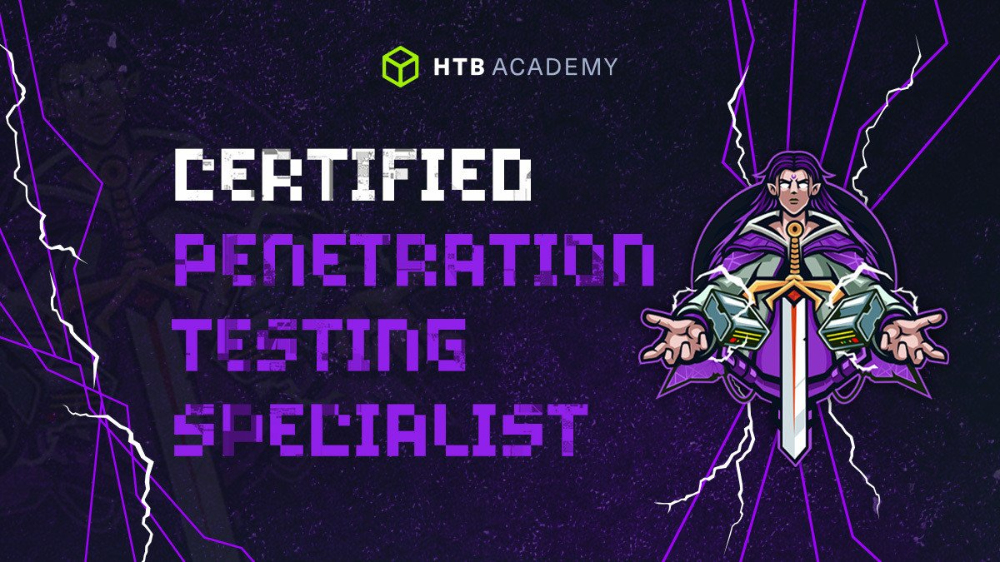

# **CPTS writeups and reports**

Repository where I will back up all the process done during the process of obtaining the Certified Penetration Testing Specialist (CPTS) in the Hack The Box platform. 

**RELATED PATH PROGRESS: 11%**

  

### **Penetration tester: path to CPTS**

| **Module**                               | **Progress** | **Difficulty** | **Check** |
|------------------------------------------|--------------|----------------|-----------|
| Penetration Testing Process              | 100%         | Fundamental    | **✔**     |
| Getting Started                          | 100%         | Fundamental    | **✔**     |
| Network Enumeration with Nmap            | 100%           | Easy           | **✔**     |
| Footprinting                             | 4.76%           | Medium         | **X**     |
| Information Gathering - Web Edition      | 20%           | Easy           | **X**     |
| Vulnerability Assessment                 | 0%           | Easy           | **X**     |
| File Transfers                           | 0%           | Medium         | **X**     |
| Shells & Payloads                        | 0%           | Medium         | **X**     |
| Using the Metasploit Framework           | 0%           | Easy           | **X**     |
| Password Attacks                         | 0%           | Medium         | **X**     |
| Attacking Common Services                | 0%           | Medium         | **X**     |
| Pivoting, Tunneling, and Port Forwarding | 0%           | Medium         | **X**     |
| Active Directory Enumeration & Attacks   | 0%           | Medium         | **X**     |
| Using Web Proxies                        | 0%           | Easy           | **X**     |
| Attacking Web Applications with Ffuf     | 0%           | Easy           | **X**     |
| Login Brute Forcing                      | 0%           | Easy           | **X**     |
| SQL Injection Fundamentals               | 0%           | Medium         | **X**     |
| SQLMap Essentials                        | 0%           | Easy           | **X**     |
| Cross-Site Scripting (XSS)               | 0%           | Easy           | **X**     |
| File Inclusion	                         | 0%           | Medium         | **X**     |
| File Upload Attacks                      | 0%           | Medium         | **X**     |
| Command Injections                       | 0%           | Medium         | **X**     |
| Web Attacks	                             | 0%           | Medium         | **X**     |
| Attacking Common Applications 	         | 0%           | Medium         | **X**     |
| Linux Privilege Escalation	             | 0%           | Easy           | **X**     |
| Windows Privilege Escalation             | 0%           | Medium         | **X**     |
| Documentation & Reporting	               | 75%           | Easy           | **X**     |
| Attacking Enterprise Networks            | 0%           | Medium         | **X**     |

**Writeups**

- [GetSimple](writeups/HTB-CPTS_GetSimple.pdf)
